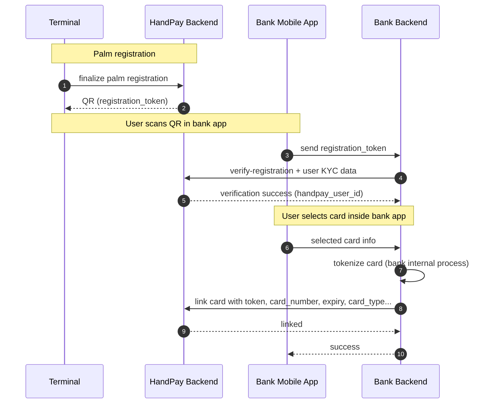
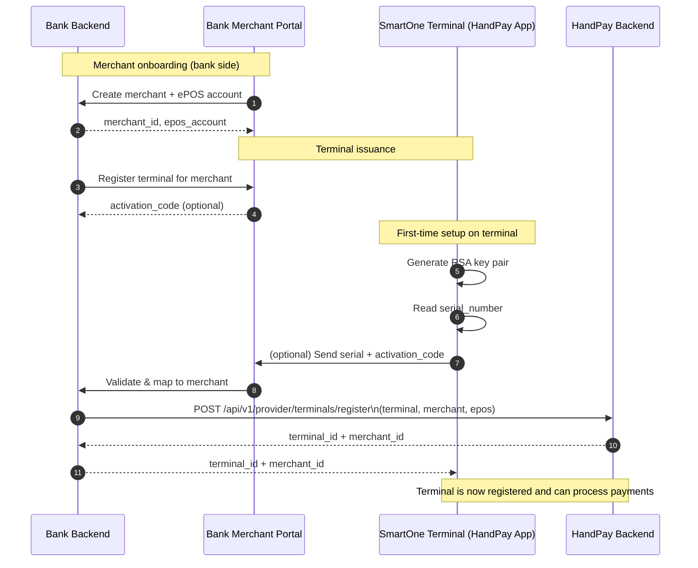

# HandPay – Complete User Registration & Card Linking Flow (Technical Specification)

_(For Payment Provider / Bank Integration)_

HandPay uses palm-vein biometrics for user authentication at payment terminals.
To enable financial transactions, each verified HandPay user must be linked with one or more tokenized bank cards.

The following flow describes the complete end-to-end registration and card linking process.

---

## 1. Overview of the Registration Flow

```mathematical
Palm Capture  →  Identity Verification (via Bank)  →  Card Selection  →  Tokenized Card Linking
```

The process begins at a HandPay-enabled terminal and finishes in the bank’s mobile application.

---

## 2. Detailed End-to-End Registration Flow

Below is the combined flow including palm registration, identity verification, and card linking.

### Step 1: Palm-Vein Registration at a Terminal

1. Customer places their palm on the terminal.
2. Terminal captures palm images using the HandPay Terminal App.
3. HandPay backend processes:

- Extracts palm-vein features.
- Creates a unique palm-vein template.
- Ensures palm uniqueness in the HandPay database.

4. When registration is successfull:

- HandPay backend generates a unique registration `token`.
- Terminal displays a QR code encoding the registration `token`.

QR Code Payload Example:

```json
{
  "token": "unique_registration_token_12345",
  "expires_at": "ISO8601 timestamp"
}
```

### Step 2: User Scans QR Code via Bank Mobile App

The bank adds a feature in their mobile app:

📲 Menu → Enable HandPay → Scan QR Code

The user scans the QR code from the terminal.
The QR only contains the registration `token`, which the app passes to the bank backend:

#### Mobile App → Bank Backend

Below is an example API request from the bank mobile app to the bank backend. Bank can implement and adapt this endpoint as needed and as they see fit.

```http
POST /api/handpay/registration/scan
Content-Type: application/json

{
  "token": "unique_registration_token_12345"
}
```

### Step 3: Bank Verifies User Identity With HandPay

The bank backend calls HandPay’s identity verification API and supplies the customer’s personal information.

#### Bank Backend → HandPay Identity Verification API

```http
POST /api/v1/provider/registration
Content-Type: application/json
Authorization: Bearer <BANK_API_KEY>
{
  "token": "string",            // Registration token obtained from the mobile app.
  "external_user_id": "string", // Bank's internal user ID. Optional but recommended.
  "user_data": {
   "first_name": "string",
   "last_name": "string",
   "phone": "string",
   "passport_pnfl": "string",
   "sex": number,            // 1 for male, 0 for female
   "birthday": "YYYY-MM-DD"
  }
}
```

HandPay Response

```http
200 OK
Content-Type: application/json
{
  "is_verified": true,
  "user_id": "uuid-of-registered-handpay-user",
  "palms": [
    {
      "id": "uuid-of-registered-palm",
      "side": "left"
    },
    {
      "id": "uuid-of-registered-palm",
      "side": "right"
    }
  ]
}
```

At this moment:

✔️ Palm is registered
✔️ Identity is verified
❌ No card is linked yet

Next, the user needs to choose a payment card.

### Step 4: Bank Presents User Cards for Linking

After successful verification, the bank mobile app must show the user’s available cards:

- Masked card number
- Card brand
- Expiry
- Card nickname

Example UI:

```yaml
Select a card to link with HandPay:
[ 8600 **** **** 4321 – UZCARD – Expires 12/28 ]
[ 9860 **** **** 5577 – HUMO – Expires 05/27 ]
```

User selects one or two cards to link (depending on registered palms).

### Step 5: Bank Tokenizes Selected Card(s)

The bank must provide HandPay with:

- Tokenized card data
- Card masked number
- Card type (HUMO, UZCARD)
- Internal card ID (on bank side)
- Card expiry date
- Card nickname (if any)
- Card Bank name

_Note: Handpay never receives nor stores complete card numbers. Only tokenized data is accepted for authorizing payments from Handpay enabled terminal._

### Step 6: Bank Links Card to HandPay User

##### Bank Backend → HandPay

```http
POST /api/v1/provider/cards/link
Content-Type: application/json
Authorization: Bearer <BANK_API_KEY>
{
  "user_id": "uuid-of-registered-handpay-user", // User ID from the Handpay API, obtained during identity verification.
  "cards": [
    {
      "palm_side": "left",                  // "left" or "right"
      "palm_id": "uuid-of-registered-palm", // Palm ID from the Handpay API, obtained during identity verification.
      "tokenized_card_data": "string",      // Tokenized card data from bank
      "card_number": "string",              // e.g. "8600 **** **** 4321"
      "card_type": "string",                // e.g. "UZCARD" or "HUMO"
      "external_card_id": "string",         // Bank's internal card ID
      "expiry_date": "MM/YY",
      "card_nickname": "string",            // Optional
      "bank_name": "string"                 // e.g. "Orient Finans Bank"
    }
  ]
}
```

_Note: This endpoint can be used to link multiple cards at once. And it can be used to override existing card links when card is deleted/expired etc._

At this point:

✔️ Palm is registered
✔️ User is identity-verified
✔️ Card token is linked
✔️ User can now perform biometric payments

---

## 3. Card Lifecycle Management

The bank must notify HandPay whenever:
✔️ User disables HandPay for a card
✔️ User deletes a card
✔️ User updates their palm card
✔️ Card expires or is replaced
✔️ Card becomes blocked/stolen

##### Delete / Unlink a Card

User removes an individual card or revokes permission for HandPay.

Where card_id = HandPay’s card ID or the bank’s internal card ID.

```http
DELETE /api/v1/provider/cards/{card_id}
Content-Type: application/json
Authorization: Bearer <BANK_API_KEY>
```

##### Disable Card for Palm Payments (Turn Off HandPay for a Card)

User temporarily disables HandPay for a specific card without deleting it.

```http
POST /api/v1/provider/cards/disable
Content-Type: application/json
Authorization: Bearer <BANK_API_KEY>
{
  "user_id": "uuid-of-registered-handpay-user", // Either user_id or passport_pnfl can be used
  "passport_pnfl": "string",
  "external_card_id": "uuid-of-linked-card"
}
```

##### Enable Card for Palm Payments (Turn On HandPay for a Card)

User re-enables HandPay for a specific card.

```http
POST /api/v1/provider/cards/enable
Content-Type: application/json
Authorization: Bearer <BANK_API_KEY>
{
  "user_id": "uuid-of-registered-handpay-user", // Either user_id or passport_pnfl can be used
  "passport_pnfl": "string",
  "external_card_id": "uuid-of-linked-card"
}
```

##### Update Card Information

Used when:

- User renames card (nickname change)
- Card is assigned to a different palm

```http
PUT /api/v1/provider/cards/update
Content-Type: application/json
Authorization: Bearer <BANK_API_KEY>
{
  "user_id": "uuid-of-registered-handpay-user", // Either user_id or passport_pnfl can be used
  "passport_pnfl": "string",
  "external_card_id": "uuid-of-linked-card",
  "palm_side": "right",                  // "left" or "right"
  "palm_id": "uuid-of-registered-palm",  // Palm ID from the Handpay API
  "card_nickname": "string"              // New nickname
}
```

## 4. User status

The bank can query HandPay to get the current status of a user’s palms and linked cards.

```http
GET /api/v1/provider/users/{user_id_or_passport_pnfl}/status
Content-Type: application/json
Authorization: Bearer <BANK_API_KEY>
```

Response:

```http
200 OK
Content-Type: application/json
{
  "user_id": "uuid-of-registered-handpay-user",
  "user_data": {
   "id": "uuid-of-registered-handpay-user",
   "first_name": "string",
   "last_name": "string",
   "phone": "string",
   "passport_pnfl": "string",
   "is_verified": true,
   "sex": number           // 1 for male, 0 for female
  },
  "palms": [
    {
      "id": "uuid-of-registered-palm",
      "side": "left",
      "linked_card": {
        "id": "uuid-of-linked-card",
        "external_card_id": "bank-internal-card-id-12345",
        "card_number": "8600 **** **** 4321",
        "card_type": "UZCARD",
        "expiry_date": "MM/YY",
        "card_nickname": "My Primary Card",
        "bank_name": "Orient Finans Bank",
        "status": "active"  // or "disabled"
      }
    },
    {
      "id": "uuid-of-registered-palm",
      "side": "right",
      "linked_card": null
    }
  ]
}
```

---

## 5. Combined Registration + Card Linking Sequence Diagram



---

## 6. What the Bank Must Implement

Mobile App:
✔ Add “Enable HandPay” section
✔ Integrate QR scanner
✔ Display user cards for linking
✔ Handle card selection per registered palm
✔ Show HandPay status page - show registered palm(s) and linked card(s)

Bank Backend:
✔ Receive registration_token from mobile app
✔ Call HandPay verification API
✔ Tokenize user-selected card(s)
✔ Call HandPay card linking API
✔ Manage card updates (add, delete, replace, block etc.)

HandPay:
✔ Provide registration token via terminal
✔ Validate user identity
✔ Store card token(s) securely
✔ Use stored tokens during payments
✔ Route payments to bank’s payment API using the token

---

# HandPay – SmartOne Terminal & Merchant Onboarding Flow

_(For Payment Provider / Bank Integration)_

## 1. Purpose

This document describes how SmartOne payment terminals running the HandPay Terminal App are:

1. Registered in the HandPay DB, and
2. Bound to a merchant (business entity) and the HandPay e-POS account provided by the bank.

Registered terminals are then allowed to:

- Send palm-based payment authorization requests to HandPay backend
- Securely authenticate every request using RSA keys

## 2. Entities

- **SmartOne Terminal** – Physical POS device used in the shop.
- **HandPay Terminal App** – App installed on the SmartOne terminal.
- **Merchant** – Business entity that owns/rents the terminal to accept payments.
- **Bank (Payment Provider)** – Issues terminals, owns e-POS accounts, processes card transactions.
- **HandPay Backend** – Manages terminals, merchants, palms, and payment routing.

## 3. Terminal Key Generation (On-Device)

On first launch or during initial setup, the HandPay Terminal App on SmartOne must:

1. Generate a unique RSA key pair (2048 bits).

- `terminal_private_key` - stored securely on the device (never leaves the terminal).
- `terminal_public_key` - shared with HandPay backend during registration.

2. Read terminal serial number from the device.
3. Collect or receive merchant assignment data (see next section).

## 4. Merchant & Terminal Registration Data

To register a terminal in the HandPay system, the following data is required:

### 4.1. Terminal Data

- `serial_number` – Unique identifier of the SmartOne terminal.
- `terminal_public_key` – RSA public key generated on-device.

### 4.2. Software Data

- `software_version` – Version of the HandPay Terminal App.
- `os_version` – Version of the SmartOne terminal OS (e.g.Android 9.0).

### 4.3. Merchant Data

- `merchant_name` – Official name of the business.
- `merchant_id` – Unique identifier assigned by the bank/payment provider.
- `merchant_tin` – Tax Identification Number.
- `checking_account` – Bank account number for settlements.
- `bank_mfo` – Bank MFO code.

### 4.4. e-POS Account Data

Bank must also provide HandPay with the e-POS account details during the initial integration (_Not in the terminal registration as same e-POS account will be used for all merchant terminal transactions and later get re-distributed to individual business/merchant accounts_).

HandPay will:

- Charge user’s tokenized card → e-POS account, and
- Later distribute funds from e-POS → merchant checking account based on the merchant registration data.

## 5. Terminal Registration API

```http
POST /api/v1/provider/terminals
Content-Type: application/json
Authorization: Bearer <TO BE AGREED WITH BANK ON AUTH METHOD OF THIS API CALL>
{
  "serial_number": "string",
  "public_key": "string",
  "software_version": "string",
  "os_version": "string",
  "merchant_data": {
    "merchant_name": "string",
    "merchant_id": "string",
    "merchant_tin": "string",
    "checking_account": "string",
    "bank_mfo": "string"
  }
}
```

Terminal uses the private key to get authentication token for future requests. This process will be automated and implemented inside the HandPay Terminal App.

## 6. Operational Workflow – Who Does What?

Since the bank issues terminals to merchants/business entities, the operational flow must be coordinated with them.
We propose the following model for the bank to review and refine.

### 6.1. Recommended Flow (Bank-Managed Provisioning)

#### 1. Bank Onboards Merchant

- Merchant opens account / signs acquiring agreement.
- Bank assigns:
  - merchant_id
  - Merchant checking account

#### 2. Bank Issues SmartOne Terminal

- Bank or SmartOne provider installs the HandPay Terminal App on the device (through MDM, factory image, or manual install).
- Device is delivered to the merchant.

#### 3. Initial Terminal Setup at Merchant Site

- Merchant powers on SmartOne terminal.
- HandPay app runs a Setup Wizard:
  1. Generates RSA key pair in the background (without any user intervention).
  2. Reads terminal serial number.
  3. Asks for activation code or merchant ID (see options below).

#### 4. Bank Backend Registers Terminal with HandPay

- Option A: Activation Code Flow:

  - Bank portal generates an activation code for a merchant and terminal.
  - Merchant enters this code into the terminal app.
  - Terminal app sends terminal and software data (documented above) + activation code → Bank backend (includes merchant data) → HandPay `/api/v1/provider/terminals` API.

- Option B: Direct Bank Call Flow:
  - Bank backend calls `/api/v1/provider/terminals` when issuing the terminal (before delivery), passing merchant data + serial number and public key collected via internal processes.

#### 5. HandPay Confirms Terminal Registration

- HandPay Backend responds with `terminal_id`, `merchant_id`.
- HandPay app stores `terminal_id` and `merchant_id` and uses them for future requests.

#### 6. Terminal is Ready for Payments

Terminal can now:

- Initiate palm registration flows
- Process palm-based payment authorizations

#### 7. Payment Initiation (Overview)

Once terminal & merchant are registered:

1. Cashier on SmartOne terminal:

- Enters amount (or the payment entry will be integrated to external POS system).

2. HandPay app on terminal:

- Starts palm authentication flow.

3. On success:

- HandPay backend:
  - Resolves palm → user → linked card → e-POS account.
  - Initiates card charge via bank’s payment API to the dedicated e-POS account.

4. Later:


    - Funds are settled from e-POS → merchant checking account according to bank’s clearing rules.

(Details of the charge API must be documented and shared by the Bank.)

#### 8. Sequence Diagram – Terminal & Merchant Registration


